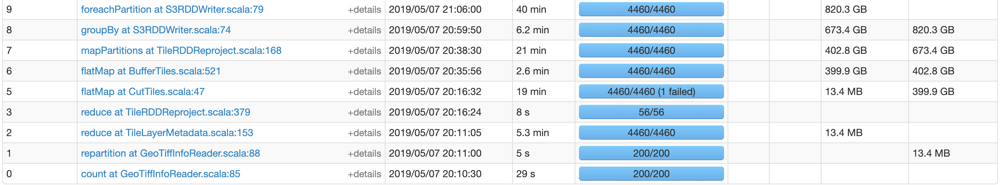
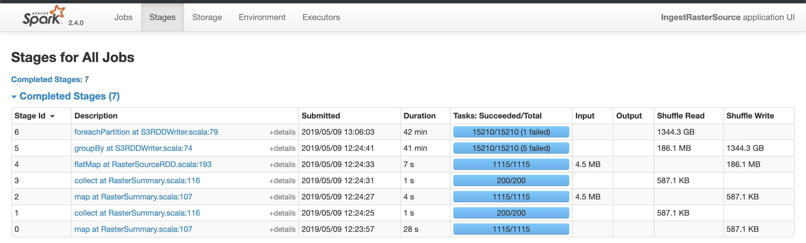
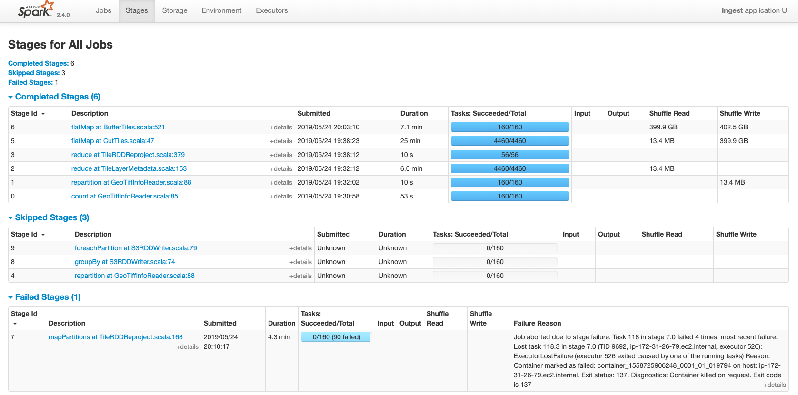
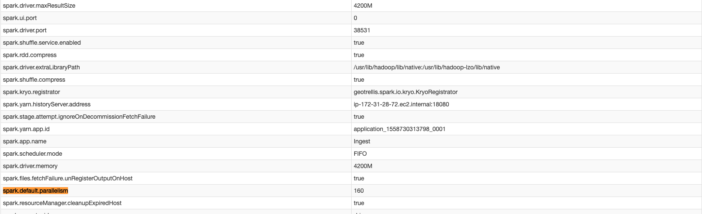

# VLM Performance project

This project is created to track down RasterSources API regressions.

NOTE: at this point, this project depends on [GeoTrellis Contrib 3.14.0-SNAPSHOT](https://github.com/geotrellis/geotrellis-contrib/tree/cc6b022d5f4ac1266b23962181d00cc9cce79e40),
it requires GeoTrellis Contrib local publish.

## Notes

Working on a cluster take into account the fact that GDAL requires a different strategy with the resources allocation.
It is not possible to use `maximizeResourceAllocation` flag with using JNI bindings. 

As the result of this work, was also figured out that `maximizeResourceAllocation` in general is not the best solution 
for GeoTrellis ingests.

### GDAL Tips

Pay attention to GDAL proper configuration:

```conf
gdal.options {
  GDAL_DISABLE_READDIR_ON_OPEN     = "TRUE" # we don't usually want to read the entire dir with tiff metadata
  CPL_VSIL_CURL_ALLOWED_EXTENSIONS = ".tif" # filter files read by extension to speed up reads
  GDAL_MAX_DATASET_POOL_SIZE       = "256" # number of allocated GDAL datasets
  GDAL_CACHEMAX                    = "1000" # number in megabyes to limit GDAL apetite
  # CPL_DEBUG                        = "ON" # to eanble GDAL logging on all nodes
}
```

For `50` `i3.xlarge` nodes it turned out that `GDAL_CACHEMAX = 1000` and `200` single core executors 
looks like a good option. For `25` `i3.xlarge` nodes `GDAL_CACHEMAX = 500` and `70` single core executors, etc.

### Ingest Results

The test dataset: [s3://azavea-datahub/raw/ned-13arcsec-geotiff](s3://azavea-datahub/raw/ned-13arcsec-geotiff)
The test dataset size: `1115 Objects - 210.7 GB`

#### 20 i3.xlarge nodes

Legacy GeoTrellis Ingest: `1 core per executor`, `1500M` RAM per executor


GeoTiff RasterSources Ingest: `1 core per executor`, `1500M` RAM per executor


GDAL RasterSources Ingest: `70 executors`, `1 core per executor`, `1500M` RAM per executor, `GDAL_CACHEMAX = 500`


#### 50 i3.xlarge nodes

Legacy GeoTrellis Ingest: `max resources allocation`, `200 executors`, `1 core per executor`, `4200M` RAM per executor.
With less RAM job is failing, maxmizing resources usage kills job as well.


GeoTiff RasterSources Ingest: `max resources allocation`, `200 executors`, `1 core per executor`, `4200M` RAM per executor
With less RAM job is failing, maxmizing resources usage kills job as well.


GDAL RasterSources Ingest: `max resources allocation`, `200 executors`, `1 core per executor`, `1500M` RAM per executor, `GDAL_CACHEMAX = 1000`


### Conclusion

The new API completely replaces the old one. The two ingests are a bit different. GDAL Ingest requires a bit
more complicated settings tuning, however, the new API is not slower and sometimes even faster.

### EMR maximizeResourceAllocation flag usage tip 

In terms of this benchmark, we figured out that [maximizeResolurceAllocation](https://docs.aws.amazon.com/emr/latest/ReleaseGuide/emr-spark-configure.html#emr-spark-maximizeresourceallocation) flag
can behave _not_ like everybody expects it to behave. The main danger here that it sets 
`spark.default.parallelism` to `2X number of CPU cores available to YARN containers`. It is a pretty
small number usually and in fact forces spark to use `spark.default.parallelism` in all 
`reduce` operations and to reshuffle data into this particular number of partitions. 

By default `Spark` tries to _preserve_ partitioning scheme. But with this option enabled it will force shuffle 
if the `partitioner` option was not _explicitly_ passed into all operations that potentially may cause shuffle.

`./sbt ingest-ned` on the cluster without `maximizeResourceAllocation` flag usage (`20 i3.xlarge nodes`):


`./sbt ingest-ned` with `maximizeResourceAllocation` flag usage:


You can notice that in the first picture we can see the _partitioning scheme preserving_.
In the second picture we see that _exactly the same application_ behaves differently after 
the `CutTiles` step and the data is repartitioned into `160` partitions 
(in this case `spark.default.parallelism` was set to `160`):


